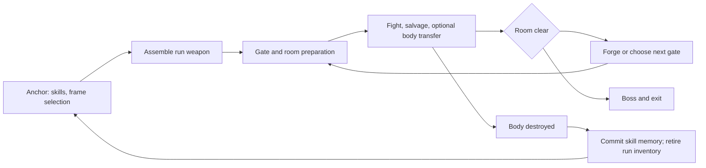

# Engram Labyrinth: story and technical specification

Planning date: 2026-10-08. Working title; not implemented. This is a separate game
mode built on the SDP combat systems, not a change to V's campaign. Read alongside
the [overhaul vision](../OVERHAUL_VISION.md) and
[Combat Arena assessment](../research/COMBAT_ARENA_TESTBED.md).

**Recommendation:** a physical containment complex with rearranging prefabricated
blocks; a roguelite run structure with readable, demanding combat and persistent
learned skills. Prove a single room, three playable body profiles and reliable death
recovery before attempting a procedural campaign or literal NPC possession.

## 1. Requirements, proposals and fiction boundary

The user's requirements are:

- The player is an engram. Their previous embodied self obtained Soulkiller-related
  technology and can make replacement bodies.
- They are trapped in a place with moving buildings.
- Entering a gate leads to a randomly selected room and enemies; clear the room to
  advance.
- Defeating an enemy provides a chance to change body, including a ten-second window
  after a kill, to experience different cyberware combinations.
- Death starts the player at the beginning in a new body.
- Skills are persistent progression across runs. Weapons are created anew each run.

Everything else below is a **proposed default**, including names, prices, timing
other than the requested ten seconds, story events and numerical tuning.

The user confirmed a **physically real structure** and suggested gate teleportation
as an alternative to literally moving buildings. Use fixed authored spaces with
controlled gate transitions for the initial implementation. Physical construction
remains the story premise; a simulation is not the selected setting.

**Lore contract:** this is an explicit alternate-continuity extension using
Cyberpunk's engram/Soulkiller premise. The complete body-manufacturing system,
reliable field transfer, short post-defeat viability window, transferable enemy
shells and moving complex are new inventions for this mode. Soulkiller is not being
presented as a canonically proven body printer, universal possession spell or
ten-second resurrection system. Manufacturing, copying/archiving a mind and
installing that mind in compatible hardware are separate machines and processes.
The mode need not resolve whether a copy is the original person.

## 2. Experience and central dilemma

**Pitch:** Your old self stole immortality and built a place to hide it. Now the
place is using your deaths to perfect it. Every gate changes the city around you;
every body you take makes escape possible and the prison more valuable.

The player should routinely decide between finishing an enemy quickly and leaving
a useful body intact; keeping a damaged but familiar build and taking unfamiliar
chrome; using scarce components on an effective weapon now and saving them for the
next forge. Losing a run destroys possessions, not the competence learned using them.

Difficulty comes from committed actions, readable enemy hardware, finite supplies,
positioning and mistakes. Do not add a universal dodge roll, stamina tax, camera
lock-on or melee-only design merely to earn the word "soulslike." Cyberpunk movement
and firearms remain central. Guns require sufficient cover, sight-line control and
attack timing for the player to make deliberate decisions.

## 3. Story specification

### Premise and location

The protagonist was an extraction technician known as **Morrow**. Their original
body stole a fragment of a personality-capture program and a separate experimental
host-interface package. With a surgical partner they built **the Foundry**, a
clandestine prototype below a decommissioned construction logistics site.

The Foundry manufactures compatible cybernetic bodies from a limited catalog of
prepared biological and synthetic components. It cannot cheaply print arbitrary
healthy humans. Routine starter bodies use reclaimed shells; rare frames need
parts acquired deeper inside. A protected **Anchor** stores the engram and incremental
skill memories. The player wakes in a fresh shell while their original body's fate
is unknown.

The surrounding **Fold** is a stacked proving ground of building modules on freight
rails and lifts. Its containment controller disconnects and rearranges routes to
prevent escape and run experiments. Buildings move beyond sealed gates or in the
distant skyline; occupied combat floors remain fixed during fights in the first
implementation. The changing routes are physical in the story even where the engine
uses a transition between fixed locations.

The gate is initially a sealed freight/transit chamber: doors close, the controller
selects and prepares a destination, a short transfer sequence plays, then the exit
opens into the next sector. The game teleports the player behind that transition.
This supports real physical sectors without adding canonical matter teleportation.
Literal instantaneous gate travel can remain a later fiction choice; moving occupied
floors remains an independent engine experiment. Destination failure returns to a
known safe chamber/Anchor and never releases the player into unloaded geometry.

Ordinary opposition uses remote combat routines in the Foundry's compatible shells.
Some contain captive engrams. This distinction explains transfer eligibility and
eventually gives the player's body-taking a moral cost. The story must flag conscious
hosts before an irreversible story choice; it should not secretly turn every early
combat reward into an untelegraphed atrocity.

### Characters and motives

| Character | Apparent role | Actual motive and gameplay expression |
| --- | --- | --- |
| Dr. Imani Vale | Surgeon and body-fabrication guide | Wants to keep the Anchor alive because it also houses people she promised to save. Offers reliable engineering information but hides how many test bodies once had occupants. Body recipes and condition assessments come through her station. |
| Custodian | Calm containment/security voice | Believes release of the transfer process will enable industrial identity theft. Rearranges routes and deploys role-specific countermeasures. Its claims are sometimes correct; it is still imprisoning people. |
| Patch | Another stranded engram, merchant and occasional ally | Wants a compatible body and access to the exit. Trades recovered instructions, remembers rescues and can help validate a route. Their welfare is a persistent story state, not an endlessly killable shop exploit. |
| The Founder | Recordings left by the previous Morrow | A branch of the protagonist that chose to keep the prison operating. It wants a successor capable of surviving outside and also wants to retain ownership. Its explanation is evidence to question, not a guaranteed account of who the player is. |

### Campaign acts

| Act | Story event | Mechanical purpose | Completion condition |
| --- | --- | --- | --- |
| I: Wake | Vale guides the first fabrication, weapon assembly and gate. Records suggest an accident caused the lockdown. | Teach one body, one damaged-shell transfer and return after death. Reveal that skill memory survives. | Beat the Recovery Warden and restore one manufacturing circuit. |
| II: Borrowed lives | Patch reveals that some "security shells" carry trapped people. The Fold rearranges to separate witnesses from the Anchor. | Add route choices, a second forge, guarded relays and optional rescue objectives. Body integrity matters more than rarity. | Obtain route authorization from two sectors; choose whether to rescue captives or use their scarce hardware. |
| III: The original | The Founder admits the protagonist helped build the containment process. Custodian shows evidence that escape could spread involuntary transfer technology. | Test mastery across profiles. Final encounters alter relay access and cover, with visible warnings rather than hidden immunity. | Defeat or disable the final containment chain and make a decision at the physical exit. |

Bosses should be original encounter roles with visible hardware and phases, not
random selections of Adam Smasher. Example: the Recovery Warden alternates a shielded
advance with exposed recovery periods; destroying its relay prevents reinforcement
but sacrifices a desirable body blueprint. A final counterpart uses a recorded
player build only from a qualified loadout catalog; actual imitation of the player's
inputs is a separate advanced feature.

### Endings and replay

- **One life outside:** destroy the field-transfer master key, choose one body and
  escape with consenting survivors. The ending relinquishes unlimited replacement
  as a story choice. Post-ending challenge runs load a clearly separate mode state.
- **Open the Foundry:** free its occupants and publish enough knowledge to challenge
  the monopoly. Survival improves for some; abuse becomes possible. The ending
  acknowledges both consequences instead of declaring effortless liberation.
- **New Custodian:** keep the system and replace its overseer. The protagonist gains
  control but repeats the Founder's decision; endless play becomes an explicit
  containment campaign.

No ending deletes the user's installation or campaign save. Ending flags affect
this mode profile, and replay/endless selection is deliberate.

## 4. Run loop and progression contract

Proposed first complete run: six combat rooms, two interleaved forge/rest opportunities
and a boss, targeting roughly 20–35 minutes after tuning. The vertical slice is much
smaller: three short encounters and one return to the Anchor.



| State | Survives body transfer | Survives run death | Rule |
| --- | --- | --- | --- |
| Skill XP, mastered techniques, learned recipe knowledge | Yes | Yes | Belongs to the engram. Technique still requires compatible hardware. |
| Story decisions and discovered frame blueprints | Yes | Yes | Blueprint access broadens choices; it does not grant a free high-tier body each run. |
| Current body, implants, wounds, armor condition | Replaced by target body state | No | Body state is never silently merged into a best-of-both build. |
| Weapon instances, ammunition, run components | Remain with their physical owner/location | No | A transfer changes location; it does not teleport the old inventory to the new body. |
| Installed deck and body firmware | Target equipment replaces old equipment | No | Compiled exploits learned by the engram remain knowledge; actual deck capacity and loaded programs are body-specific. |
| Security alerts, room knowledge, active alarms | Yes | New run resets | Changing bodies is not automatically an undetectable identity reset. |
| Persistent manufacturing stock | Only if deliberately banked at Anchor | Yes | Keep this small and separate from skill XP; the starter frame remains available after failure. |

Learned skills improve handling, execution and mastery. They do not teach the engram
how to manifest missing cyberware. A runner profile can use known software; a profile
without a deck cannot. Body attributes/capacity are a mode-specific adapter over SDP
skill mapping, with no silent overwrite of campaign progression.

Retain level scaling. Snapshot the chosen difficulty envelope and player compatibility
level when a run begins. At room preparation select opponents within that envelope
and the current depth budget; do not secretly rescale a live enemy after a body swap.
Later runs can scale with new skills. Native scaling may need scoped overrides to
achieve a genuine freeze; logging a snapshot alone does not implement one.

No new psychological-humanity bar is proposed for this mode's engram protagonist.
Compatibility and frame capacity constrain body builds. This is a mode choice, not
an assertion that every non-V engram has V's unusual tolerance. The separate zombie
mode can have its own humanity policy.

## 5. Body transfer: precise gameplay contract

### Eligibility and the ten-second window

Proposed default: transfer into the specific defeated enemy's compatible shell,
rather than opening a global body-selection menu after any kill.

1. A committed defeat event for a mode-owned, eligible hostile creates one candidate.
   Death and incapacitation notifications for the same entity resolve to one event.
   This occurs after real damage resolution, never after projected damage/UI previews.
2. Candidates have a ten-second expiry measured in unscaled active world time.
   A true game pause pauses it; scanning, slow-motion and a live radial menu do not.
   A later kill creates its own window and does not refresh previous candidates.
3. Default interaction requires the player within 5 m with an unobstructed transfer
   link. The UI shows frame, usable chrome, wounds, condition, held weapon and remaining
   time before the player commits. This range is tuning, not a lore claim.
4. The transfer is a 0.75-second exposed channel. Request and channel completion must
   both precede expiry; at exactly the deadline the candidate is expired. Successful
   channel completion revalidates and locks the claim for a bounded equipment
   transaction. Asynchronous equipment callback time is not added to the player's
   ten-second challenge. Before that lock, a qualifying interrupt or lost link
   cancels without consuming the candidate. No player damage-dealing ability may
   run during final mutation; incoming damage cannot simply be discarded.
5. Eligible shells need an intact host-interface core, compatible profile and an
   unused restart reserve. Humans outside the program, drones, vehicles, unqualified
   bosses and quest actors are ineligible. Destroyed limbs affect the new body; major
   neural/core destruction rejects it. Ordinary headshots need not all destroy that
   core: actual damage category/threshold controls eligibility, with visible feedback.
6. An eligible defeated shell has a **one-use auxiliary restart reserve**. Its
   incapacitation in combat need not mean its structural shell is ruined. Activating
   the reserve yields the shell's declared restart condition, initially about 30%
   of its usable maximum health, reduced by structural damage. This is new prototype
   fiction and a proposed balance number. It is not a free full heal or a native
   resurrection feature. Explosive overkill can leave no viable reserve.
7. Each shell can be occupied once per run. Leaving it makes it unavailable for
   another transfer. Old/new inventories remain distinct to prevent endless switching
   for fresh consumables or repeated rewards.

The player's current body is not healed on a kill. Taking another shell can improve
or worsen survival because its physical condition differs. The player can inspect
that tradeoff; a low-health transfer is not automatically an upgrade.

### State migration

| Component | Required behavior on successful transfer |
| --- | --- |
| Identity and location | Keep the logical engram and mode profile; relocate the controlled player to a validated point beside the target shell with its orientation and profile. No teleport through a wall merely because the corpse is close. |
| Skills and technique | Keep earned knowledge once. Recalculate supported effects against the new hardware; do not re-award milestone bonuses. |
| Health, injuries and armor | Apply target restart health, target wounds and target armor integrity. Do not use old health percentage or reset all injury flags. Reject unsupported injury/profile combinations during qualification. |
| Cyberware | Remove only old profile-owned packages, then apply the new qualified loadout through equipment-compatible flows. Never stack residual passives. |
| Resource pools | Use target reserve/ammo/charge state; target deck RAM starts at its documented remaining/startup value. No refill simply because a new item was equipped. |
| Cooldowns and heat | Keep each target component's remaining cooldown/heat. An abandoned body's cooldown cannot be reset by returning, because it is ineligible. Enforce any engram-level transfer lock separately. |
| Status effects | Physical bleeding, burning, poison and limb injury stay with the affected shell; software effects stay with their defined host. Engram marks and ongoing relay trace follow the engram. Classify allowlisted effects instead of clearing every status effect globally. |
| Incoming hacks/projectiles | Intended semantics: ordinary physical attacks remain aimed at the physical shell they targeted, while engram/relay traces persist. Reusing PlayerPuppet can cause homing projectiles or uploads to follow its new location; this behavior requires explicit testing and adapters. Until qualified, visibly reject transfer during affected target-lock/upload states or omit those attack types from the prototype. Never claim exact physical target continuity merely because the player was teleported. |
| Weapons and loot | The old body's weapons form a single recoverable cache in that room. The new body brings only its actual recoverable inventory. Reclaimed gun specifications keep their instance identity. Caches expire when leaving the room. |
| Enemy awareness | Old observations remain historical; enemies detect the new host through witnessed transfer, sensors or communication. MVP may treat an observed transfer as continuous hostile identity, but must disclose that policy. |

### Transaction, cancellation and rollback

Use a mode-owned transfer state machine:

`candidate -> reserved -> channeling -> committing -> committed`

Any pre-commit failure releases the reservation and leaves both bodies unchanged.
At the end of the exposed channel, snapshot the current profile and inventory,
recheck expiry/target validity, lock ownership, resolve a safe destination, then apply
equipment/state and verify
postconditions before consuming the target and abandoning the old shell. A transfer
ID makes repeated callbacks idempotent. Only one transaction can be active.

Final equipment mutation may need a short gated interval so native equip callbacks
cannot interleave conflicting actions; it is not a combat invulnerability reward.
Log its duration and enforce a bounded timeout. A failed transaction releases the
claim only if its original deadline is still open; failure never creates fresh time.
If safe rollback cannot be established, reconstruct a safe Anchor state within the
current session, preserving already committed skills and retiring run items once.
Do not load an older Anchor save and silently erase meta progress. Display the
recovery result rather than leaving a half-swapped inventory. A transaction journal
must make save/load in the middle either restore
the pre-transfer state or complete once, never produce two copies of the equipment.

Death wins over a merely requested/channeling transfer. During equipment mutation
before the final commit marker, damage belongs to the old logical body: its recovery
snapshot must incorporate that damage, and a lethal result aborts the transfer and
enters defeat. After the marker, damage belongs to the new body. Native partial
equipment updates must not accidentally choose the wrong defenses or restore HP
lost during the transaction; proving this boundary is an E1 acceptance requirement.
A transfer already committed is judged using its new body's state. Set event ordering explicitly for simultaneous
lethal hits, target destruction and the expiry boundary; never revive through a late
queued callback. A future emergency-on-death transfer is a different optional mechanic.

## 6. Player implementation strategy

**Stage A — qualified profiles on the existing PlayerPuppet.** Keep the game's player
entity and change its equipment, capabilities, body state and supported appearance.
Spawn a body/cache prop only if needed for presentation. Implement three tested
profiles first: mobile frame, armored frame and deck frame. The opponent record maps
to a player-compatible profile; NPC stats are not blindly copied into player stats.

This can deliver the different cyberware flavor immediately, but it must be called
a profile transfer until matching appearances and behavior are verified. Stages can
reuse a common player skeleton. Do not promise all enemy body shapes or first-person
arms will work by switching one record.

**Stage B — visible qualified bodies.** Add a deliberately small collection of
compatible player appearances, arm assets, animation checks and body-specific
movement. Validate equipped weapon aim, mantis arms, Gorilla Arms, camera, clothing
and third-person scenes for each supported profile.

**Stage C — true NPC possession research.** Only pursue actual controller handoff if
a prototype demonstrates locomotion, input, camera, HUD, abilities, damage attribution,
inventory, save/load and recovery. Codeware's inspected PlayerSystem additions expose
the player and preview puppets; they do not establish arbitrary playable-NPC handoff.
[Tool source](https://github.com/psiberx/cp2077-codeware/blob/main/scripts/Player/PlayerSystem.reds).
The native game does declare `LocalPlayerControlExistingObject(EntityID)`; see the
[feasibility audit](ENGINE_FEASIBILITY.md#3-player-identity-and-the-body-swap-boundary).
That is a candidate control API, not proof an arbitrary NPC supports player systems.
Failure at this gate does not invalidate the profile-based game mode.

Native equip prerequisites and gameplay-package application need proper adapters;
the existing source paths are recorded in
[equipment research](../research/LOW_LEVEL_SYSTEMS.md#4-cyberware-and-equipment).
The cyberware catalog must specify separate enemy and player implementations.

## 7. Rooms, moving buildings and the encounter director

### Practical procedural architecture

The first procedural system generates a **graph of encounters**, not meshes or
navigation at runtime. Choose a seed, then select from fixed qualified rooms and
place allowed enemy groups at known points. Gates can lead to spatially separated
locations behind a brief transition. The world looks rearranged because the graph,
window vistas, room variants and route connections change.

Each room definition needs: stable ID/revision, entry and exit transforms, clear
walkable bounds, spawn points, cover points, tested movement routes, safe return point,
device/network references where present, encounter budget, permitted enemy roles,
maximum simultaneous actors, recovery policy and allowed environmental variants.

Use existing validated spaces for technical prototypes. A bespoke physical Fold
needs an asset/world-building pass with authored collision, navigation, cover,
streaming and audio. Moving a building mesh does not move or regenerate these systems.
Runtime movement of occupied floors and dynamic navmesh regeneration are **unproven
research**, not baseline requirements. Animated skyline machinery and gate transitions
provide the intended look first.

Codeware documents record-based dynamic spawning, session/save lifecycles and static
entity management. These are useful ingredients, not proof that a spawned room has
AI navigation or security wiring. Use character records for functional NPCs and wait
for attachment before starting combat. Its wiki also distinguishes save-bound
dynamic entities from globally persistent services; mode progression must not be
stored in an unscoped global counter.
[Codeware author documentation](https://github.com/psiberx/cp2077-codeware/wiki/).

### Generation constraints

- Guarantee entry-to-exit navigation and at least one recoverable run path. Do not
  require a double jump, body type or hack unless that capability is guaranteed.
- Avoid consecutive duplicate rooms and impossible combinations of long-range
  shooters in coverless spaces. Use authored composition templates under a budget.
- Gate previews show broad threat and reward categories, not every enemy's location.
  Hacking/scanning can improve intelligence through the existing recon policy.
- Snapshot the roster on room creation. Readiness failures block the start and trigger
  a bounded retry or visibly invalid room, not a silent missing enemy/reward.
- Count objective-qualified combatants, not every globally hostile entity. A detached,
  stuck or escaping actor cannot trap a run forever. Recovery logs the fault and
  removes only the registered blocker; it never grants farmable extra XP.
- Seed the director's choices and record them. Native AI, physics and scheduling remain
  nondeterministic; a seed is not a promise of identical combat outcomes.

### AI behavior and fairness

Initial compositions: cover shooters with one flanker; a durable frontliner with a
support unit; a movement specialist with a clear approach lane; a later qualified
runner with visible relay access. Enemies use observations, squad communication,
limited supplies and declared cyberware. A wounded shell can become a transfer target
without allowing the director to spawn untelegraphed replacements beside the player.

The room director controls composition and gates. It does not overwrite enemy
last-known positions every few seconds. The Combat Arena source audit found exactly
that kind of forced information, as well as HP and immortality confounders. Reuse
its isolated test-location/spawning lessons; do not invoke its survival director or
shared mutation tags for this mode.
[Audited arena behavior](../research/COMBAT_ARENA_TESTBED.md#useful-foundations-and-confounding-behavior).

Netrunner rooms require a qualified runner and a declared access path. The current
custom-program executor and native upload model do not yet establish general
enemy/player symmetry or independent concurrent uploads.
[Netrunning research](../research/LOW_LEVEL_SYSTEMS.md).
Start with an operational deck profile and limited tested hacks; the entire network
overhaul is not a prerequisite for proving the room/transfer/death loop.

## 8. Weapons and run economy

At the Anchor, assemble a starter weapon using the run's allocation and learned
recipes. During the run, recover receivers, functional parts and components. At a
forge, commit a recipe transaction to rebuild or modify a weapon. Example choices:
stable suppressed receiver with modest capacity; high-output barrel with heat and
recoil; compact movement build with lower sustained fire. Arbitrary geometry and
unsupported animation combinations are outside the first version.

Start with two weapon families and a small allowlisted parts catalog. Store each
weapon as `weaponInstanceId + versioned specification + condition + ownerRunId`.
Changing one gun must not rewrite a shared TweakDB record for all enemies. Salvage
destroys the source once and yields less than the complete build cost. A body swap
does not duplicate the gun or carry it across space.

Recipe knowledge survives death; built guns and ordinary parts do not. Optional
named memorials of previous weapons can remain in the Anchor without creating free
copies. This supports "future iconics" while making each run's material choices
matter. Avoid requiring repeated low-risk farming before the starter build is viable.
Native crafting supplies a starting transaction path, not a proven arbitrary
assembler: [crafting research](../research/LOW_LEVEL_SYSTEMS.md#5-weapons-and-crafting).

## 9. Technical ownership and persisted data

Names below describe proposed responsibilities, not existing callable APIs.

| Component | Owns | Must not own |
| --- | --- | --- |
| Mode session coordinator | Exclusive activation, lifecycle, entry baseline and safe return | Global campaign death behavior when mode is inactive |
| Run director | Seed, room graph, depth, frozen difficulty envelope, encounter registry | Per-hit damage formulas or hidden enemy knowledge |
| Body profile adapter | Qualified equipment, capabilities, pool/state mapping | Persistent learned skill ledger |
| Transfer controller | Ten-second candidates, reservation, transaction and rollback | Arbitrary NPC-control guarantees |
| Anchor persistence | Profile progression, recipe knowledge, story state and event deduplication | Raw transient entity references across loads |
| Run inventory service | Materials, weapon instances, body caches and salvage transactions | Original campaign inventory |
| Presentation | Gate preview, shell inspection, countdown, Anchor UI and story delivery | Independent copies of authoritative state |

Persist at least:

```text
ModeProfile: profileId, schemaVersion, skillLedger, awardedEventIds,
  knownRecipes, frameUnlocks, bankedStock, storyFlags, completedRuns
RunState: runId, seed, generatorVersion, frozenDifficulty, roomGraph,
  currentRoomId, roomRevision, bodyInstanceId, inventorySpec, eventSequence
BodyState: bodyInstanceId, profileId, componentIds, health, injuries,
  armorIntegrity, pools, effectsWithOwnership, cooldowns, occupiedOnce
TransferJournal: transactionId, runId, candidateId, state,
  beforeSnapshot, intendedAfterSnapshot, commitMarker
```

Prototype on a dedicated mode save. Skills survive an ordinary **in-mode death** by
committing valid skill events before retiring the run and rebuilding a starter body.
Use unique `(runId, eventSequence)` IDs so duplicate hit/death callbacks do not award
progress twice. The normal save system controls disk durability; no claim is made
that unsaved recent XP survives a process crash.

Default persistence is bound to the mode playthrough/profile. Loading an older game
save may roll back its mode progress; do not silently keep global progression from
another character. Cross-save/profile progression is a separate opt-in product
decision requiring a namespaced store and conflict rules.

For the MVP, suspend only at the Anchor or a cleared-room gate. Defer custom
mid-transfer saves if the engine allows it; journal recovery must still handle a
load/crash during partially applied callbacks. Persist remaining timer durations
only in supported snapshots, never reuse a process wall-clock deadline after reload.
Begin with checkpoint reconstruction rather than promising byte-perfect restoration
of an active fight. Enter/exit and repeated activation must not leak equipment,
immortality, time dilation, input locks, listeners or artificial AI stimuli.

## 10. Death and recovery

Interception must be mode-scoped and cover bullets, DoTs, explosions, fall damage,
environmental hazards and simultaneous transfer events. Combat Arena demonstrates
an immortality/low-HP defeat pattern, but that does not prove all native death and
quest paths can safely be replaced.
[Local audit](../research/COMBAT_ARENA_TESTBED.md#useful-foundations-and-confounding-behavior).

Prototype a terminal state with mutually exclusive transitions:

`running -> defeat_requested -> rewards_committed -> run_retired -> anchor_ready`

Death commits only already-earned skill/story events, ends uploads and body sessions,
retires run inventory once, invalidates delayed callbacks by run generation, then
rebuilds the starter profile at a validated Anchor position. Never refund all run
materials and also allow recovery of the dead run's copies. A proposed optional
corpse-recovery mechanic would need a separate loss ledger; it is not in the MVP.

Guarantee a viable starter body and starter weapon after any failure. A lost run may
cost rare frames and upgrades but must not leave the player unable to begin again.
If reliable interception fails, a temporary explicit defeat threshold on an isolated
test save can validate the rest of the loop; ship claims must then describe that
limitation until real lethal-path qualification is complete.

## 11. Build stages and acceptance gates

| Stage | Deliverable | Exit gate |
| --- | --- | --- |
| E0: lifecycle proof | One room, one shooter, Anchor return, mode-owned tags and logs | Repeated entry/abort/defeat works without campaign inventory or modifier leakage; independent of normal Combat Arena survival mode. |
| E1: transfer proof | Two then three qualified profiles, candidate UI and ten-second transaction | Skills unchanged; target wounds/resources honored; no duplicate items/passives; expired, destroyed and interrupted targets handled correctly. |
| E2: complete vertical slice | Three encounters, one forge, one original boss pattern, restart and persistent skill gain | A fresh player can complete or fail a run, understand transfer limits, and restart with earned skills. |
| E3: procedural graph | At least six qualified room templates, role compositions and deterministic director choices | Every generated route is reachable with guaranteed equipment; seeded generation and failed setup are logged. |
| E4: narrative alpha | First act, Vale/Patch/Custodian delivery, frame unlocks and checkpoint reconstruction | Story decisions and save migrations survive reload; all supported builds can reach the act boss. |
| E5: expansion | Additional acts, visual moving modules, richer profiles and network encounters | Profile, navigation, performance and network qualification pass separately. |
| Optional research | True NPC possession, occupied moving geometry, recorded-player rivals | Each feature earns its own proof; none blocks completion of E0–E4. |

There is no credible hour estimate before E0/E1. The highest-risk features are
arbitrary body possession, robust gear/state migration, death interception and
streamed custom navigation. Randomizing an encounter list is comparatively modest.

## 12. Test specification

| Test | Required observation |
| --- | --- |
| Ten-second boundary | Requests just before/after expiry; exposed channel finishing at/after expiry fails; pause freezes; slow-motion and scanner do not lengthen the window. After a timely claim lock, slow equipment callbacks do not retroactively fail the deadline, but transaction timeout must recover coherently. |
| Duplicate defeat events | One candidate, one skill award and one reward per registered entity. |
| Transfer interrupt | Damage, line loss, target deletion, unsafe destination and second transfer input leave the old build intact without consuming an eligible target. |
| Transfer state | Compare skill ledger, equipment packages, maximum/current pools, wounds, armor and cooldowns before/after; no bonuses remain from abandoned hardware. |
| Inventory identity | Crafted gun transfers to old-body cache once; pickup, swap, salvage and save/load cannot duplicate it or components. |
| Concurrent lethal events | Player death, target destruction and commit in adjacent frames produce exactly one valid terminal state. |
| Effect ownership | Old body's bleed stays behind; target fire remains dangerous; engram trace persists; projectile and upload attribution is defined. |
| Run restart | Bullets, fall, DoT, explosion and void/failsafe defeat retire run items once and preserve committed skills. |
| Callback cleanup | Ten successive restart/abort cycles leave no extra active enemies, candidate timers, handlers, immortality or forced-location stimuli. |
| Room readiness | Missing actor, blocked exit, failed navigation, failed runner and missing asset create a visible recoverable fault. |
| Save isolation | Campaign save/profile remains separate; old-schema mode saves migrate or reject safely; reload during a transaction never grants two inventories. |
| Balance across skills | Repeat controlled early/mid/late skill profiles with matched room budgets; ensure learning stays rewarding without making low-tier rooms mandatory XP farms. |

Use the proposed TestLab's run manifest and event logging. Measure transfer success,
rejection cause, health/gear deltas, restart latency and invalid run count alongside
TTK. Do not call a ten-second-timer unit test evidence that player equipment and
death paths work in engine.

## 13. Open decisions with recommended defaults

| Decision | Recommended default | Alternative and consequence |
| --- | --- | --- |
| Gate presentation within the confirmed physical setting | Sealed transfer chamber between fixed authored sectors; teleport occurs behind the transition | Visible instantaneous teleportation adds new fictional technology; literal moving occupied buildings add unqualified engine work. |
| Which body after a kill? | That defeated eligible shell, within its own ten-second window | A global selector makes build changes convenient but weakens battlefield choice and needs a different fiction. |
| How literal is possession? | Player profile/appearance adaptation first | True NPC control requires a separate feasibility proof and can delay the entire project. |
| Does a kill automatically repair the next body? | One-use prepared-shell reserve, damaged condition shown before transfer | Full-health transfers create a very different aggressive healing economy; no reserve makes most lethally defeated bodies unusable. |
| What survives death? | Earned skills, knowledge and story; run equipment is lost | Banking only at checkpoints adds extraction pressure but contradicts effortless persistent learning unless explained and chosen deliberately. |
| Does an older save keep later meta progress? | No; default is save/profile-bound progression | A global ledger needs an explicit cross-save policy and robust conflict handling. |
| Weapons on transfer? | Physical inventory stays with each body; old gear can be recovered | Instant gear carryover is simpler but becomes another fictional transfer capability. |
| Humanity? | No separate psychological meter; frame compatibility and capacity | Adding one needs an engram-specific design, not automatic reuse of the zombie protagonist's system. |
| Endless or ending? | Finite story run structure plus explicit endless mode | Pure endless mode reduces narrative work but leaves the captivity plot unresolved. |

## Sources and evidence limits

- Existing source-qualified research:
  [arena](../research/COMBAT_ARENA_TESTBED.md),
  [low-level systems](../research/LOW_LEVEL_SYSTEMS.md),
  [AI](../research/AI_BEHAVIOR.md) and [source map](../research/SOURCE_MAP.md).
- [Codeware author wiki](https://github.com/psiberx/cp2077-codeware/wiki/) and
  [DynamicEntitySpec source](https://github.com/psiberx/cp2077-codeware/blob/main/scripts/World/DynamicEntitySpec.reds)
  document the spawn/lifecycle ingredients; reviewed 2026-10-08. Installed framework
  compatibility is not established by the current online documentation.
- [Codeware PlayerSystem source](https://github.com/psiberx/cp2077-codeware/blob/main/scripts/Player/PlayerSystem.reds)
  does not, by those inspected extensions alone, establish possession support.

All story characters and events above are original proposals. The detailed
manufacturing and transfer fiction is not presented as verified canonical lore.
No playable mode, new world assets, compiler test or live engine trial was produced
by this planning document.
