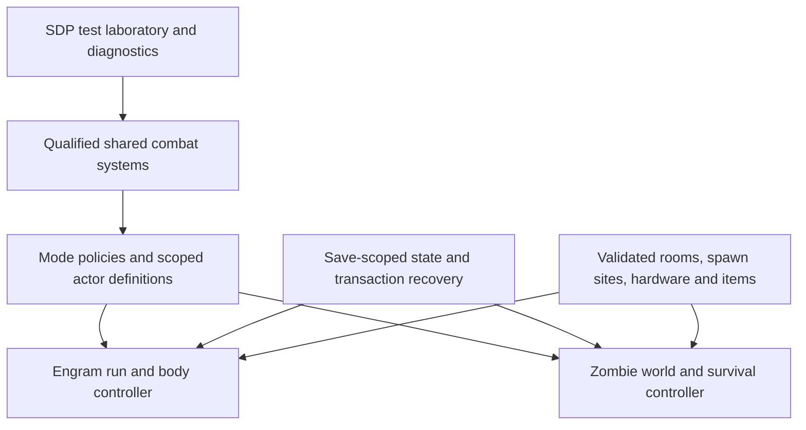

# Alternate game modes: story and engineering plans

Planned: 2026-10-08. These are two proposed standalone mode campaigns built on
selected SDP systems. **No mode is implemented by these documents.** Names are
working titles; mechanics not explicitly requested remain proposed defaults.

| Mode | Player fantasy | Primary loop | Persistent identity |
| --- | --- | --- | --- |
| [Engram Labyrinth](ENGRAM_LABYRINTH.md) | An engram escaping a physical, reconfigurable prison through disposable bodies | Enter a gate, survive a room, claim a defeated shell within its transfer window, craft a weapon, choose the next gate | Learned skills and recovered knowledge survive bodily death |
| [Dead Signal](DEAD_SIGNAL.md) | A scavenger surviving an infected Night City by harvesting and rebuilding chrome | Leave the central refuge, navigate increasingly dangerous territory, scavenge, extract, install and recover | A vulnerable human with lasting augmentation and psychological costs |

Read the mode documents for story acts, characters, endings, player rules and
technical contracts. Read [engine feasibility](ENGINE_FEASIBILITY.md) for inspected
APIs, limitations and experiments. The [Combat Arena assessment](../research/COMBAT_ARENA_TESTBED.md)
is the immediate test-environment foundation; its isolated controller is still planned.

## Decisions carried forward

| Topic | Status / interpretation |
| --- | --- |
| Engram protagonist, self-created bodies, random rooms/enemies, new weapons each run, skills as meta progression | User requirements |
| Body changes after defeating an enemy / within ten seconds of a kill | User requirement; the mode spec chooses an explicit eligibility/window contract |
| Physically real structure | Confirmed by the user after considering the simulation alternative |
| Gate teleportation | User-suggested alternative to moving structures; recommended direction, pending prototype |
| Literally moving occupied buildings | Desired atmosphere; not a proven capability or MVP dependency |
| Infected city, central spawn, greater danger farther out, movement, scavenged cyberware, non-V protagonist with humanity pressure | User requirements |
| Specific names, antagonists, endings, resource values and difficulty curves | Design proposals |
| Full base-game story alongside either mode | Not assumed; propose separate mode saves/profiles and authored mode progression |

The engram mode combines deliberate combat and consequential death with randomized
runs and persistent learning. Existing gunplay, movement, cover and chrome provide
its combat vocabulary; readable threats and counters matter more than adopting a
different camera or melee animation system.

## Physical spaces and gate travel

Recommend **fixed, authored combat spaces connected by controlled gate transitions**.
The facility is physically real in the story. A sealed gate chamber transfers
occupants between sectors whose routes reconfigure. The controller chooses a
destination, waits for streaming/readiness, relocates the player and opens the exit.
The mode spec distinguishes concealed transport from literal teleportation as an
additional fictional technology.

First prove two validated spaces with a fade/loading transition, checking player
control, equipment, actors, navigation and cleanup. A seamless animated gate is a
later improvement. Generating a room graph does not generate navigable geometry.
Decorative distant structures can eventually move while combat floors remain fixed.
Occupied moving structures require separate collision/navigation/cover and streaming
tests; the first release should not depend on those tests succeeding.

## Relationship to the original overhaul

The [original overhaul](../OVERHAUL_VISION.md) remains a V campaign with retained
level scaling and no required psychological humanity management. The zombie mode
changes that rule because its protagonist is not V. Native `Humanity` stats used
for cyberware capacity must remain separate from its psychological state model.

| Domain | V overhaul | Engram mode | Zombie mode |
| --- | --- | --- | --- |
| Death | Native campaign policy | Lose active run/body; restart in a replacement body with learned skills | Its own proposed campaign checkpoint/recovery policy |
| Skills | Learned and shard-assisted | Engram-owned mastery independent of shell | Survivor mastery in its own campaign ledger |
| Chrome | Exceptional V tolerance; equipment/capacity constraints | Shell hardware and compatibility | Physical capacity plus psychological strain/recovery |
| Weapons | Long-term signature crafting | New physical weapons each run; recipes may persist | Repair and assemble scarce salvaged weapons |
| Scaling | Retained within role/faction bounds | Run depth and body/skill context; freeze encounter selection at entry | Geographic gradient primary; any player-level term bounded |
| Networks | Scoped permissions and entry paths | Facility subnets and gate/transfer access | Broken infrastructure, infected clusters and relay interference |

Every effect needs a mechanism. Neutralization can expose an emergency transfer
interface; it does not heal the current body or refill its ammunition. Harvesting
yields a damaged physical component requiring processing, not a pristine implant.

## Shared engineering contracts

Names here describe proposed interfaces, not existing APIs.

1. **Mode ownership.** Declare mode/campaign IDs, schema/content/configuration
   versions and lifecycle state. Mode-off delegates to the original game. Profiles
   are mutually exclusive. Script guards cannot undo global TweakXL record edits:
   use separately deployed profiles or scoped cloned records and audit shared hooks.
2. **Character separation.** Learned identity, current body capabilities and item
   state have separate owners. Body changes never reset skill XP; equipment modifiers
   never write proficiency XP. One adapter resolves native attributes/Level/PowerLevel
   to avoid duplicate scaling.
3. **Actor definitions.** Each preset declares its record, behavior/equipment
   prerequisites, chrome, spawn constraints and reward policy. Player implants and
   NPC abilities can need different adapters. Appearance does not prove capability.
4. **Transactions.** Body transfer, crafting, harvesting and installation reserve
   inputs, validate prerequisites, commit once, then retire consumed entities/items.
   Failure releases reservations or restores prior state. Save-scoped transaction
   IDs prevent duplicate grants after reload.
5. **Persistence.** Separate campaign skills/knowledge from run/world items, cells,
   bodies and salvage claims. Temporary entity IDs are runtime handles, not durable
   ownership identifiers; persist stable mode IDs even when an engine persistence
   option can preserve entity identity. Reconcile spawned entities on load. Do not use
   account-global service storage accidentally for save-specific progression.
6. **Lifecycle.** Handle session ready, suspend, resume, death, reload and unload.
   Delayed work carries a run/session generation. Loading an older save restores
   that timeline; future claims must not leak backward into its deduplication ledger.
7. **Simulation budgets.** Simulate close actors fully and distant content logically.
   Choose actor/corpse/effect budgets from measurements on the target machine.
8. **Observability.** Record run IDs, effective stats/levels, actors, resource changes,
   state transitions and failure reasons. Gate debug controls from normal play.

Extract only the shared lifecycle, identity and diagnostic interfaces proven useful
by the prototypes; avoid building an elaborate framework before either mode works.

## Recommended development order

| Stage | Deliverable | Acceptance gate |
| --- | --- | --- |
| 0. Test environment | Fixed actor, known gear, reset and event logs | Arena survival health/AI/death overrides cannot contaminate measurements |
| 1A. Engram transfer/gate prototype | Two physical spaces, gate transition, two shell profiles, transfer and restart; feeds E0/E1 before the larger E2 slice | No duplicated modifiers/items, broken control or unintended skill loss after death/load |
| 1B. Zombie slice | Central refuge, nearby route and harder outer route, infected presets, one salvage/install path | Stable navigation/population, spatial threat increase, exactly-once salvage and restored saves |
| 2. Choose production focus | Playtest both slices on the same combat baseline | Intended decisions work without an unproven engine capability |
| 3. Complete campaign loop | Engram boss/escape choice; zombie expedition/relay objective | Beginning, consequence, recovery and ending function in a dedicated save |
| 4. Expand content | More rooms/shells or districts/infected roles, then story chapters | Added content passes functional and performance checks |

These are dependency stages, not calendar estimates. Engram is the recommended
first production focus because bounded spaces make content and AI validation more
tractable. Zombie city conversion has wider streaming/world-interaction risks.

## Shared acceptance scenarios

- Switch profiles and load an ordinary campaign: no actors, hidden god mode, time
  dilation, HUD state or world suppression leaks across profiles.
- Reload during each transaction: recover old or committed state without duplicate
  cyberware, weapons, rewards or XP.
- Engram death resets the attempt within the session and retains committed skill
  gains. Deliberately loading an older save restores that older timeline instead.
- Die during transfer, installation or gate travel: one owner resolves death and
  respawn; two competing handlers never run.
- Change supported slots/configuration: detect invalid equipment and reconcile;
  removed equipment leaves no invisible bonuses.
- Spawn/despawn/revisit a cell: progression and claims persist as specified, while
  transient references and listeners do not accumulate.
- Compare low-chrome and heavily augmented builds: difficulty has causal reasons;
  mandatory traversal retains a supported route for the starting loadout.
- Hide from enemies: the director supplies only explicitly authored information,
  without silently disclosing the protagonist's current location each tick.

The linked specs include story spoilers and proposed defaults. Playtests should
settle transfer range/channel time, death losses, run length, outer-ring caps,
humanity recovery and installation costs. Custom protagonist presentation, new
animations and full campaign compatibility remain feasibility work. New transfer
technology and outbreak explanations are alternate-continuity fiction, not claims
that Soulkiller canonically permits unlimited instant body hopping or that
cyberpsychosis is a contagious zombie disease.
