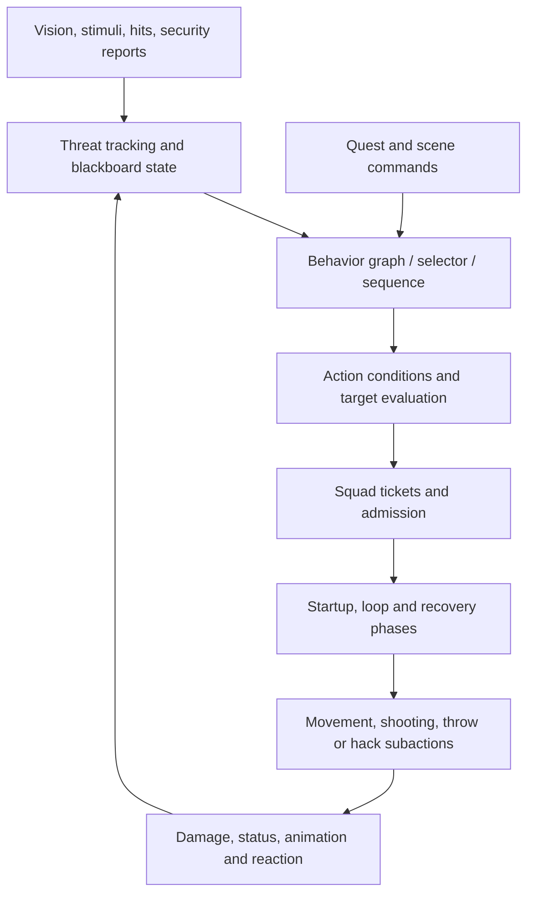

# AI behavior research

This report distinguishes inspected script behavior, earlier record measurements,
native engine boundaries and proposed changes. See [research scope](README.md)
and the [source map](SOURCE_MAP.md). It does not claim to reconstruct every NPC
behavior graph or to measure the active in-game AI configuration.

## 1. How an NPC reaches an action

This is a logical view. Some stages cooperate rather than forming one strictly
serial function chain.

**SOURCE:** `TweakAIAction` resolves an `AIAction_Record`. `TweakAIActionAbstract`
tracks initialization, animation availability, ticket commitment/acknowledgment,
phases and subaction results. Its update can remain in progress because tickets or
animations are not ready. It updates general subactions plus startup/loop/recovery
subactions. [N-ai-record](SOURCE_MAP.md#n-ai-record),
[N-ai-update](SOURCE_MAP.md#n-ai-update), [N-ai-phases](SOURCE_MAP.md#n-ai-phases).

**Native boundary:** action activation and target evaluation delegate to the native
tweak action system. A public record type gives us fields to inspect, not proof of
its runtime selection frequency or every hidden condition.

**DOCUMENTED:** `.behavior` assets connect condition/task nodes and other behavior
files to script tasks and TweakDB actions. This pass did not extract or walk those
assets. [Behavior-format documentation](https://wiki.redmodding.org/cyberpunk-2077-modding/for-mod-creators-theory/files-and-what-they-do/file-formats/behaviors-.behavior-files).

Implementation consequence: keep native action execution initially; improve
observation inputs and bounded role decisions around it. Replacing a whole behavior
graph should follow a demonstrated limitation, not be the default starting point.

## 2. Perception, knowledge and communication

`SenseComponent` exposes detection/visibility interfaces. `TargetTrackingExtension`
supports hostile threats, injection of entity or positional threats and persistence.
Security-system relationships and squad membership provide additional information
paths. [N-perception](SOURCE_MAP.md#n-perception).

`AIActionTarget.Get` evaluates a target record through native code. The source also
contains legacy helpers; do not assume a legacy helper is the active path merely
because its implementation is visible. [N-ai-target](SOURCE_MAP.md#n-ai-target).

The earlier October 5 audit counted action target records using RealPosition and
SharedBeliefPosition, and inspected threat-tracking settings. Those counts remain
**HISTORICAL**: they were not re-dumped here. Two qualifications are essential:

- RealPosition says which position an action may receive. It does not independently
  prove that action activates through walls; conditions, visibility and navigation
  can still block it.
- A field named `moveBeliefOnlyIfVisible=false` suggests a question about hidden
  updates, but does not establish native update semantics or communication latency.

Our desired standard is stronger than either name: record each usable observation
with origin/time, and trace how every decision consumes it. Authorized simulation
code may know true coordinates for rendering/collision, but tactical policy should
not obtain an unobserved target update from that access.

### Current SDP information limits — SOURCE

`SDPBlindFire.Observe` requires a non-blind shooter and visible target. `Freeze`
uses the stored point, or a fixed initial facing point if none was observed. This
is a useful local implementation of honest blind shooting. [M-blind](SOURCE_MAP.md#m-blind).

It does not cover the entire AI. For example, non-blind cadence reads the player's
live world position for distance; flank selection reads live player velocity;
reengagement has live-distance checks. These need classification: a lifecycle check
may be harmless, but a tactical condition can reveal hidden movement even when
the final aim point is remembered. [M-cadence](SOURCE_MAP.md#m-cadence),
[M-flank](SOURCE_MAP.md#m-flank).

## 3. Squad tickets and action concurrency

`PuppetSquadInterface.EvaluateTicketActivation` checks current orders, cooldown,
acknowledgment delay and activation conditions. Record fields include maximum,
minimum, percentage, synchronization and filtering rules. Actions commit and wait
for tickets in their lifecycle. [N-tickets](SOURCE_MAP.md#n-tickets),
[N-ai-update](SOURCE_MAP.md#n-ai-update).

These are contextual squad/action admission limits. A record value of one does
not justify saying that exactly one enemy across the entire game can act, or that
there can only ever be one grenade in flight.

**HISTORICAL starting points**, from the October 5 project audit, not a fresh
verified vanilla capture:

| Record family | Previously recorded values | Why it matters |
| --- | --- | --- |
| Melee | max 1 | Limits admission to relevant melee actions |
| Quickhack | max 1, associated 8-second cooldown | One throttle among several hacking gates |
| GrenadeThrow / Hard | max 1 / 2, associated 15-second cooldown | Throw admission, not complete stock or flight accounting |
| CatchUp / Hard | max 2 / 3; a 30-second cooldown was recorded | Pursuit timing and squad distribution |
| Peek | max 2 | Relevant cover exposure admission |

**Current source:** SDP's `ChaseLimits.yaml` sets CatchUp to 4, Easy to 3, Hard to 4
and its named cooldown to 8 seconds. Effective values still depend on all loaded
record writers and squad overrides.

Proposed replacement constraints must exist before raising limits: space and friendly
fire for melee, supply and throw safety for grenades, routes and per-session budgets
for hacks, cover reservations and doctrine for pursuit. Retain performance bounds.

## 4. Shooting and apparent accuracy

There are separate controls:

1. Whether the action can run and has a valid target.
2. Pause conditions, firing timestamp, trigger/charge state and shot-count limits.
3. Authored pattern delays passed into weapon scheduling.
4. Aim/target evaluation and weapon behavior.
5. Conditional time-between-hits miss handling.
6. Actual collision, damage modifiers and defensive effects.

`AISubActionShootWithWeapon.Update` waits for delays, pause conditions and the next
shot time, then resolves the target. `QueueNextShot` looks up the current pattern's
delay and passes it to `AIWeapon.QueueNextShot`. `ShouldTrackTarget` includes special
attack exceptions and smart-weapon lock behavior.
[N-shoot](SOURCE_MAP.md#n-shoot).

`TargetShootComponent.HandleBeingShot` first checks native `IsTimeBetweenHitsEnabled`.
In the enabled path, `ShouldBeHit` compares time since the target component's last
hit timestamp with a product of coefficients. Failure returns a miss offset. The
coefficients include accuracy, distance, group, cover, difficulty and visibility.
[N-hit-gate](SOURCE_MAP.md#n-hit-gate), [N-hit-clock](SOURCE_MAP.md#n-hit-clock).

This supports a target-associated hit-spacing mechanism on that path. It does
**not** mean every bullet/weapon/attack in the game is globally scheduled, nor does
an allowed shot prove a final health hit. Enabling conditions and bypasses must be
measured for smart weapons, special attacks and other actor types.

Current SDP wraps the shot handler and weapon fire path for enrolled actors, then
uses weapon/shooter dispersion, visibility samples and blind memory. It wraps
cadence separately with recoil recovery and aiming delay. Preserve that separation
in telemetry: action admission, requested shot, allowed/miss sample, impact and
actual damage are different events.

## 5. Grenades, ammo and friendly fire

The inspected throw subaction retrieves an item in an attachment slot, resolves a
target and trajectory, records a grenade timestamp, launches the projectile and
removes the item from the slot. Missing required slot/target/item can fail the action.
[N-grenade](SOURCE_MAP.md#n-grenade).

This proves the launch mechanism, not finite reserve stock. A provisioning subaction,
equipment group or native inventory path may supply a replacement. Trace that
creation/refill path for each chosen archetype before writing a finite-inventory
adapter. Likewise, reload animations and an ammo condition do not prove a finite
reserve-ammunition model.

Damage-side friendly fire has explicit flags and attitude checks. Without the
FriendlyFire flag, a friendly relationship can mark a hit DealNoDamage; self-hits
also have a CanDamageSelf gate. [N-friendly-fire](SOURCE_MAP.md#n-friendly-fire).
There are also AI friendly-fire condition/subaction record types. Therefore a useful
grenade overhaul must separately establish:

- Blast/trajectory safety and squad intent before throwing.
- Supply reservation and consumption at the actual successful launch.
- Correct damage filtering after impact.
- Release of reservations on cancellation and failed animation/trajectory.

Do not globally enable friendly-fire flags without preserving authored allies and
mission-dependent behavior.

## 6. Netrunners and relay behavior

The NPC hack subaction resolves its target, creates a `HackTargetEvent`, and uses
linked effects/proxy visualization. `GetNetrunnerProxy` considers a security sensor
following the target and visible threats reported by squad members.
[N-ai-hack](SOURCE_MAP.md#n-ai-hack), [N-proxy](SOURCE_MAP.md#n-proxy).

Thus native hacking already contains a relay-like relationship. It is not evidence
that the game authenticates subnet permissions or simulates arbitrary network hops.
Use it as an adapter input, not the complete access model.

Incoming hacking adds further restrictions: BeingHacked, retries, target upload
pool, listener/HUD, save lock and attacking-runner identity. The
[low-level report](LOW_LEVEL_SYSTEMS.md#10-enemy-uploads-why-concurrency-needs-redesign)
details the chain. A new defender should be able to establish/repair a route, protect
access, interrupt an intruder and relocate—not only select a higher-damage hack.

Proposed role ladder:

| Role | Decision policy | Plausible limits |
| --- | --- | --- |
| Stock-program user | Opportunistic known exploits with limited target scope | Few tools, weak route acquisition and limited defense |
| Combat runner | Seek cover/relay, disable key hardware, coordinate a push | Finite concurrent work and dependence on relays |
| Security defender | Monitor intrusion, revoke access, isolate subsystems | Must preserve the facility's own operations |
| Expert | Adapt payload/route, counter-trace, support or retreat as needed | Strong but explicit resources and interruptible dependencies |

These are new policies, not existing native archetype guarantees.

## 7. Suppression, flanking, morale and retreat

Current CE-derived suppression listens to gunshot/silenced-gunshot stimuli from the
player. It approximates a firing corridor using player position and active-camera
forward, adds pressure, decays it over time and applies profile-based pin thresholds
and morale effects. It does not measure every projectile near miss or symmetrically
model all NPC/player suppression. [M-suppress](SOURCE_MAP.md#m-suppress).

Current flanking is conditional on actor state, profile probability, pin/suppress
state, cooldown and player velocity. It computes a side position around a believed
player point and requests repositioning. The surrounding maneuver layer must still
find/execute a usable move. [M-flank](SOURCE_MAP.md#m-flank).

Morale/flee code already reacts to wounds, faction profiles and nearby losses, with
delayed recovery/reengagement. This supplies implementation material, but does not
yet prove a coherent squad policy with communicated observations and shared cover
reservations. Separate true squad decisions from independent per-NPC reactions.

Proposed squad episode state: known contacts, roles, cover/route reservations,
supplies, casualty information actually received, current intent and fallback plan.
Use bounded decision intervals and significant-event reevaluation. Avoid issuing
replacement movement commands every frame or cancelling every native animation.

## 8. Cyberware use and role identity

More implant stats do not guarantee better activation. For each capability inspect
the ability assignment, action selector, activation conditions, phase/subactions,
cooldowns, immunity tags and movement/animation requirements.

The current SDP CE subset's chrome file is explicitly detection-only; distribution
is omitted. Prior ENC/CR/TDO audits describe useful donor mechanisms but are
**HISTORICAL**, not newly validated dependency closures. A shared hardware definition
still needs an NPC activation adapter and a test for actual use.
[M-chrome](SOURCE_MAP.md#m-chrome).

Example acceptance: an eligible Sandy user activates for an appropriate threat,
spends its budget, exhibits the expected movement/time interaction, responds to a
valid disable effect, and recovers correctly. A stat/record assignment alone passes
none of those behavior checks.

## 9. Authored control and performance

Current guards recognize dead/downed actors, lore/grapple effects, follower/no-reaction
presets, off-mesh links, workspots, dialogue and scenes. Preserve these protections
when inserting tactical decisions. They are useful defenses, not a proof that every
quest actor is safe to command. [M-authored](SOURCE_MAP.md#m-authored).

Native action execution also waits for animation readiness and tickets. Treat
failure/timeout as normal outcomes; release owned reservations and fall back cleanly.
Avoid global scans of all actors each frame. Limit work to registered relevant actors,
use events where practical, and schedule sensing/decision queries with bounded cost.

## 10. Required trace for a meaningful AI experiment

For each decision collect: actor/profile; current action and phase; target ID;
observation source/age/position; visibility; selected target tracking mode; ticket
request/result; relevant cooldown and resource state; requested command; actual
start/end/interruption; projectile/hack result. Log reason codes for declined actions.

A visible result such as "NPC stood still" can mean no target, no ticket, no valid
cover, missing animation, active quest control or a deliberate defensive decision.
Without those intermediate states, tuning the delay or damage is guesswork.

The [validation backlog](VALIDATION_BACKLOG.md) translates these questions into
repeatable scenarios rather than treating greater aggression as proof of better AI.
