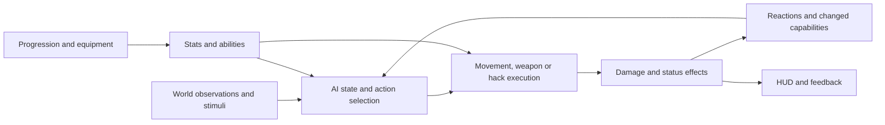

# High-level design: native Cyberpunk and the overhaul

Read [evidence labels and version scope](README.md) first. Statements under
"Overhaul" are proposals unless marked as explicit decisions in the
[vision](../OVERHAUL_VISION.md).

## 1. The native architecture as a gameplay model

Cyberpunk combines progression, equipment and conditional abilities. Many effects
are assembled from database records: an item or action points to packages, status
effects, prerequisites, modifiers and effectors. The same visible effect can also
have hardcoded script branches, actor-specific restrictions and animation behavior.
An effect's name or tooltip does not describe its complete implementation.

This is an explanatory model, not a full engine call graph. Exact source anchors
and native-code boundaries appear in the [low-level report](LOW_LEVEL_SYSTEMS.md).

## 2. Progression: attributes, perk points, skills and rewards

**Native, SOURCE/DOCUMENTED.** Skills retain XP and level data; proficiency rewards
invoke effectors. Purchased perk ranks are separately recorded, activated and paid
for with development points. Some ranks have script-side effects in addition to
their gameplay packages. The modern five-skill system is independent of attribute
caps. [Native rewards and purchase paths](SOURCE_MAP.md#n-rewards).

**Current SDP, SOURCE.** Skill totals drive displayed rank and compatibility level;
separate TweakXL modifiers drive PowerLevel. Attribute allocation and new ordinary
point awards are intercepted. Training shards have their own XP, permanent mastery
and effect packages. Existing vanilla purchases are preserved and reconciled with
shard copies. Milestone code already replaces the level-15/35 point rewards with
small skill benefits. [Current milestones](SOURCE_MAP.md#m-milestones).

**Overhaul.** Audit abilities by mechanism before redesigning the shard roster.
Technique rewards belong in training; hardware/software benefits need the appropriate
dependency. Remove the effect itself when it has no credible mechanism. Flattening
the visible shard tree is insufficient if scripts still query native perk ranks.

**Unresolved.** Full perk-to-shard audit, replacement skill rewards, mastery migration,
specialist access and the degree of genuine technique dependency.

## 3. Scaling and encounter strength

**Native, DOCUMENTED.** CDPR's 2.0 baseline describes NPC level scaling, faction
tiers, archetype armor differences, tier-based weapon damage, and level-dependent
loot/vendor stock. Scaling is therefore connected to several systems rather than
one enemy-health multiplier. [CDPR baseline](https://www.cyberpunk.net/en/news/49060/update-2-0).

**Current SDP, SOURCE.** With skill sum S: displayed rank is S-4; compatibility
level uses the floored average progression; PowerLevel is 0.2*S. Those are different
signals. The native ICE helper explicitly mixes player Level and target PowerLevel.
[Level implementation](SOURCE_MAP.md#m-level), [ICE coupling](SOURCE_MAP.md#n-ice).

**Overhaul.** Retain scaling, as requested. Bound allowed loadouts by faction and
role, then calibrate numerical scaling and encounter composition separately. Snapshot
encounter selection rather than secretly changing opposition after an equipment swap.
The exact native scaling curves and their effective modded values need a fresh dump.

**Risk.** Double-counting progression through skill passives, PowerLevel, weapon
tier, cyberware capacity and enemy rarity can overwhelm visible equipment differences.

## 4. Player and enemy cyberware

**Native, SOURCE.** Player equipment has slot and item packages, prerequisites and
install/uninstall flows. Capacity-related script logic uses stats named Humanity,
HumanityAvailable and HumanityOverallocated. NPC capabilities also depend on their
character/archetype records and AI actions; equipping a player item is not proof an
NPC can activate it. [Equipment](SOURCE_MAP.md#n-equip), [capacity naming](SOURCE_MAP.md#n-capacity).

**Current SDP, SOURCE.** Skill-based capacity already exists. Cyberware-EX slot
expansions use shard-specific sentinel requirements. The reduced CE code identifies
NPC chrome/archetypes but explicitly omits chrome distribution. ENC integration
must be distinguished from capability assignment owned by SDP itself.

**Overhaul.** Use a shared hardware specification with separate player and NPC
adapters. Each implant needs capability, activation policy, resource costs, damage/
disable behavior and feedback. V does not need psychological humanity management;
physical capacity may remain independently useful.

**Risk.** More slots do not automatically create safe simultaneous operating systems,
input mappings or animation combinations. Cyberware-EX's current customization sets
CombinedAbilityMode to false; combined activations need deliberate testing.

## 5. Weapons, crafting and economy

**Native, SOURCE.** Crafting is recipe/item based: known recipes, ingredient costs,
inventory transactions, item quality and upgrade processing. Equipment parts and
gameplay packages provide extension points. [Crafting transaction](SOURCE_MAP.md#n-crafting).

**Current SDP, SOURCE.** Combat reads weapon handling and damage information to
drive NPC aim/cadence and selected damage behavior. Quickhack crafting provides a
useful saved-design/native-menu pattern, but is not a finished weapon construction
system.

**Overhaul.** Start with supported weapon families and meaningful component tradeoffs.
Store the constructed weapon's identity and installed parts; derive handling and
damage from that specification. Signature behavior should have mechanical causes.
Align salvage, component costs, repair and vendor pricing with the same economy.

**Unresolved.** Per-instance names/records, attachment persistence, upgrade identity,
salvage accounting, weapon animation compatibility and NPC use of custom variants.

## 6. Armor, damage, injuries and healing

**Native, SOURCE.** Damage passes through preprocessing, source/target modifiers,
armor, other modifiers, one-shot protection and health application. Native armor
uses a reduction multiplier with penetration and armored hit-shape handling. It does
not implement our current probabilistic plate-penetration/integrity model.
[Native pipeline](SOURCE_MAP.md#n-damage), [armor](SOURCE_MAP.md#n-armor).

**Current SDP, SOURCE.** Armor kits contain pieces, coverage and integrity. The best
intact covering piece is selected. Penetration is probabilistic; stopped hits retain
blunt damage. Eligible penetrating head hits can be made fatal. NPC limb crippling
is a separate CE-derived hook. These are current implementation choices, not newly
approved universal rules.

**Overhaul.** Resolve protection before deciding injury severity. Separate stabilization,
health recovery and treatment. Distinguish biological damage from damaged hardware.
Persistence, treatment UI, supply consumption and player injury attribution remain
new work.

**Critical integration risks.** Existing NPC crippling reads damage during the earlier
localized-damage stage. Stateful armor can also be reached by projected damage.
Resolve both before using the current encounter as a balance baseline.

**Healing, SOURCE/DOCUMENTED.** The native charge helpers and listeners distinguish
recharging use charges from inventory quantity. Replacing automatic replenishment
requires auditing charge writers and medical cyberware, not only editing a cooldown.
The native health-item/grenade recharge design is documented in
[CDPR's update notes](https://www.cyberpunk.net/en/news/49060/update-2-0).

## 7. Quickhack execution and custom software

**Native, SOURCE/DATA.** Quickhacks combine action eligibility, RAM payment, upload,
queues, status effects, packages, effectors and AI reactions. Different hacks carry
different stacking and interruption behavior. ICE, damage resistance and trace are
distinct concerns. [Cost](SOURCE_MAP.md#n-hack-cost), [effects](SOURCE_MAP.md#n-hack-effects).

The stored Overheat T3 example has a Burning status, up to two stacks, periodic
thermal attacks, duration modification and AI reaction prerequisites. The numeric
output is capture-specific. It demonstrates why a hack cannot be specified only as
"damage plus duration."

**Current SDP, SOURCE.** Designs persist in player development data, compile into
program slots, enter the native scanner menu and trigger a custom executor. The
execution callback checks that V was the instigator and the target is an NPC.
[Executor boundary](SOURCE_MAP.md#m-custom-hacks).

**Overhaul.** Share the program's semantics while implementing separate actor adapters.
Retain feedback and status interactions, and explicitly budget complexity, RAM,
upload, detection and compatible target systems. Do not assume a player-instigator
effect package behaves correctly when applied by an NPC.

## 8. Network access and enemy netrunners

**Native, SOURCE.** Access points have breach state and connected-device propagation.
Enemy hacking already has proxy selection from security sensors and squad members,
linked effects, incoming-upload handling and interruption paths. These mechanisms
are not evidence of a general permissioned network simulation.
[Access](SOURCE_MAP.md#n-access), [proxies](SOURCE_MAP.md#n-proxy).

**Reference, DOCUMENTED.** Better Netrunning distinguishes root, personnel,
surveillance and defense access. Access points, backdoors and unconscious actors
offer different entry permissions. Its description also includes configurable
exceptions for targets/networks without normal entry points. This is a design
reference, not a verified integration against the current loadout.
[Author description](https://www.nexusmods.com/cyberpunk2077/mods/2302).

**Overhaul.** Build an access ledger and route lifecycle over useful native
relationships. Treat target discovery, connectivity, authorization, upload and
trace as separate states. A runner can know where V is without possessing a route
into V's implants. A camera can supply observation without granting personnel access.

**Key constraint.** Native BeingHacked/retry logic and upload/HUD state serialize
parts of incoming hacking. Multiple independent attacks require a session model,
not merely a higher Quickhack ticket count. [Incoming gate](SOURCE_MAP.md#n-incoming-hack).

## 9. AI behavior, grenades and logistics

**Native, SOURCE.** AI uses sensed/tracked information, action records, conditions,
selectors, phased subactions, squad tickets, movement policies and animations.
Shooting decisions include pattern delays and a conditional time-between-hits path.
Grenade launch uses equipped objects, target/trajectory data and slot removal.
[Detailed AI report](AI_BEHAVIOR.md).

**Current SDP, SOURCE.** Weapon-derived aim/cadence, blind-shot memory, suppression,
flank/flee behavior and authored-control guards exist. Their limits matter: suppression
uses player gunshot stimuli and a camera-direction approximation; blind memory does
not make every other tactical decision information-correct.

**Overhaul.** Add role-based decisions and supply budgets before loosening tickets.
Friendly-fire risk requires both decision-side avoidance and actual damage rules.
Fleeing, regrouping and protecting specialists can be competent responses.

**Unresolved.** Native reserve-ammo replenishment and grenade provisioning across
archetypes were not fully traced. An item leaving a hand slot does not prove finite
reserve stock. Per-action records and native condition evaluation need runtime traces.

## 10. HUD, cameras and reconnaissance

**Native, SOURCE.** Tags fan out into scanning, forced reveal, UI and blackboard
state. Minimap visibility considers seen/tagged/highlighted/detection history,
companions, death and special prevention/quest handling. Sensors expose target lists
and have shutdown behavior. Remote-control systems contain quest locks.
[Tagging](SOURCE_MAP.md#n-tag), [minimap](SOURCE_MAP.md#n-minimap), [sensors](SOURCE_MAP.md#n-sensor).

**Overhaul.** Build one contact store that records source, position, timestamp,
confidence and live/stale state. Make minimap, outlines and scanner read it. A tag
records an observation; a live feed or tracking exploit maintains a moving contact.

**Drone limitation.** Existing camera takeover and Spiderbot-related actions show
useful components. They do not establish a reusable, freely deployable recon drone
with movement, collision, input, recall and save support. Prototype stationary
cameras first; research movable recon as a separate feature.

## 11. Architecture consequences

Prefer a small shared policy layer for observations, access, capability definitions
and resource ownership. Keep existing engine actions, animations and inventory
systems where possible. Each actor adapter translates shared rules into the native
player/NPC path rather than forcing both through an inappropriate common hook.

The first combined encounter should prove that information affects decisions,
network isolation changes hacking, armor changes injury, and finite supplies change
enemy behavior. More abilities and higher numbers cannot substitute for that proof.
